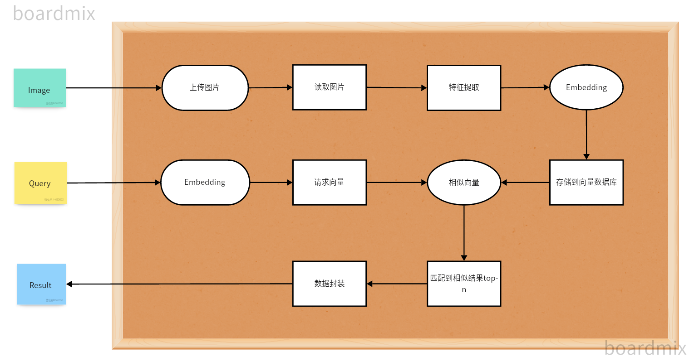
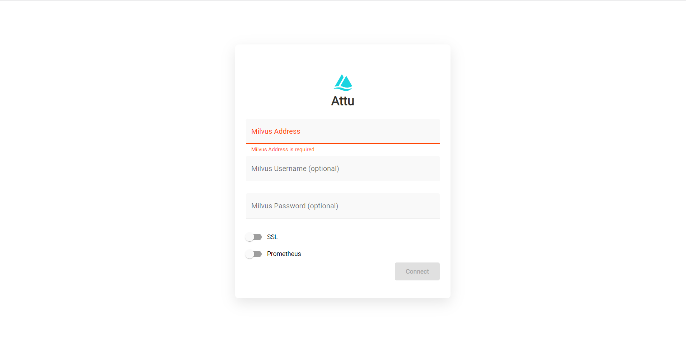
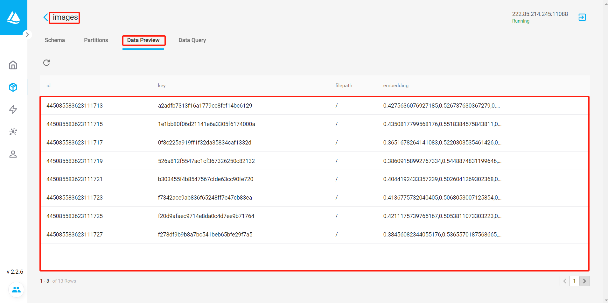

--- 

## 🚨介绍

💡 一种利用图片特征向量及向量数据库作为基础，🌘使用向量相似检索技术实现用图片搜索相似图片的技术。

📺 实现原理



本项目实现原理如图所示，过程包括加载图片 -> 读取图片 -> 特征提取 -> 存储到向量数据库 -> 待检索图片 -> 在图片向量库中匹配出与待检索图片向量最相似的 `top n`个 -> 匹配到相似结果 -> 返回结果。

---

##  🚀使用
### Docker 部署 

1、通过已有的基础镜像启动（这种方式会自动安装mivus数据库，API应用依赖的包已经包含在bogv-base镜像之中，可以一键启动）  
🐳 Docker 基础镜像地址: `registry.cn-chengdu.aliyuncs.com/mrrobot_public/bogv-base:1.1`

```docker-compose.yml
version: '3.5'

services:
  etcd:
    container_name: milvus-etcd
    image: quay.io/coreos/etcd:v3.5.5
    environment:
      - ETCD_AUTO_COMPACTION_MODE=revision
      - ETCD_AUTO_COMPACTION_RETENTION=1000
      - ETCD_QUOTA_BACKEND_BYTES=4294967296
      - ETCD_SNAPSHOT_COUNT=50000
    volumes:
      - ${DOCKER_VOLUME_DIRECTORY:-.}/volumes/etcd:/etcd
    command: etcd -advertise-client-urls=http://127.0.0.1:2379 -listen-client-urls http://0.0.0.0:2379 --data-dir /etcd

  minio:
    container_name: milvus-minio
    image: minio/minio:RELEASE.2023-03-20T20-16-18Z
    environment:
      MINIO_ACCESS_KEY: minioadmin
      MINIO_SECRET_KEY: minioadmin
    volumes:
      - ${DOCKER_VOLUME_DIRECTORY:-.}/volumes/minio:/minio_data
    command: minio server /minio_data
    healthcheck:
      test: ["CMD", "curl", "-f", "http://localhost:9000/minio/health/live"]
      interval: 30s
      timeout: 20s
      retries: 3

  standalone:
    container_name: milvus-standalone
    image: milvusdb/milvus:v2.2.11
    command: ["milvus", "run", "standalone"]
    environment:
      ETCD_ENDPOINTS: etcd:2379
      MINIO_ADDRESS: minio:9000
    volumes:
      - ${DOCKER_VOLUME_DIRECTORY:-.}/volumes/milvus:/var/lib/milvus
    ports:
      - "19530:19530"
      - "9091:9091"
    depends_on:
      - "etcd"
      - "minio"

  attu:
    container_name: milvus-attu
    image: zilliz/attu:v2.2.6
    environment:
      MILVUS_URL: milvus-standalone:19530
    ports:
      - "19531:3000"
    depends_on:
      - "standalone"

  # API接口
  bogv:
    container_name: bogv-api
    image: registry.cn-chengdu.aliyuncs.com/mrrobot_public/bogv-base:1.1
    restart: always
    ports:
      - "7000:7000"
    volumes:
      - /etc/localtime:/etc/localtime
      - ./:/app
    environment:
      - TZ=Asia/Shanghai
      - MILVUS_HOST=milvus-standalone
      - MILVUS_PORT=19530
      # 接口校验的TOKEN，不配置不进行校验
      # TOKEN = 
    working_dir: /app  # 设置容器的工作目录
    command: sh -c "python main.py"
    privileged: true

networks:
  default:
    name: milvus
```

2、通过在线下载依赖的方式构建镜像并启动（这种方式会自动安装mivus数据库，API应用依赖会在容器启动过程中在线下载，依赖安装好之后才可以正常启动）
```docker-compose.yml
version: '3.5'

services:
  etcd:
    container_name: milvus-etcd
    image: quay.io/coreos/etcd:v3.5.5
    environment:
      - ETCD_AUTO_COMPACTION_MODE=revision
      - ETCD_AUTO_COMPACTION_RETENTION=1000
      - ETCD_QUOTA_BACKEND_BYTES=4294967296
      - ETCD_SNAPSHOT_COUNT=50000
    volumes:
      - ${DOCKER_VOLUME_DIRECTORY:-.}/volumes/etcd:/etcd
    command: etcd -advertise-client-urls=http://127.0.0.1:2379 -listen-client-urls http://0.0.0.0:2379 --data-dir /etcd

  minio:
    container_name: milvus-minio
    image: minio/minio:RELEASE.2023-03-20T20-16-18Z
    environment:
      MINIO_ACCESS_KEY: minioadmin
      MINIO_SECRET_KEY: minioadmin
    volumes:
      - ${DOCKER_VOLUME_DIRECTORY:-.}/volumes/minio:/minio_data
    command: minio server /minio_data
    healthcheck:
      test: ["CMD", "curl", "-f", "http://localhost:9000/minio/health/live"]
      interval: 30s
      timeout: 20s
      retries: 3

  standalone:
    container_name: milvus-standalone
    image: milvusdb/milvus:v2.2.11
    command: ["milvus", "run", "standalone"]
    environment:
      ETCD_ENDPOINTS: etcd:2379
      MINIO_ADDRESS: minio:9000
    volumes:
      - ${DOCKER_VOLUME_DIRECTORY:-.}/volumes/milvus:/var/lib/milvus
    ports:
      - "19530:19530"
      - "9091:9091"
    depends_on:
      - "etcd"
      - "minio"

  attu:
    container_name: milvus-attu
    image: zilliz/attu:v2.2.6
    environment:
      MILVUS_URL: milvus-standalone:19530
    ports:
      - "19531:3000"
    depends_on:
      - "standalone"

  # API接口
  bogv:
    container_name: bogv-api
    image: python:3.7
    restart: always
    ports:
      - "7000:7000"
    volumes:
      - /etc/localtime:/etc/localtime
      - ./:/app
    environment:
      - TZ=Asia/Shanghai
      - MILVUS_HOST=milvus-standalone
      - MILVUS_PORT=19530
      # 接口校验的TOKEN，不配置不进行校验
      # TOKEN = 
    working_dir: /app  # 设置容器的工作目录
    command: sh -c "pip install -i https://mirrors.aliyun.com/pypi/simple/ -r requirements.txt && python main.py"
    privileged: true

networks:
  default:
    name: milvus
```

## ✅可视化  
项目部署好以后访问以下地址：  
```
IP:19531
```
  
登录之后加载图数据库，打开向量数据库的管理页面，在data preview中可以看到上传的图向量数据.  




## ⚡️API介绍

### 1、图片文件上传（文件流方式）
```http
POST /api/image/sim/add/file
```
### Description：
通过formdata的方式上传图片到文件搜索系统.

### Request Params：(Content-Type:multipart/form-data;)
请求头：
| Parameter | Type     | Required | Description               |
|-----------|----------|----------|---------------------------|
| `token`  | String   | No      | token，非必填，当环境变量中配置了TOKEN这个变量时，才会开启校验.    |  

请求体：
| Parameter | Type     | Required | Description               |
|-----------|----------|----------|---------------------------|
| `file`  | File   | Yes      | 文件，必要参数.    |
| `key`  | String      | No       | 外部系统主键或者md5，用于数据返回后可以通过这个字段查找外部系统记录，不传的情况下默认计算md5作为key.    |
| `imgPath`  | String  | No      | 图片相对路径或者绝对路径.    |

### Request Return：   
sucess return
```http
{
	"msg": "存储图片成功！",
	"code": 200,
	"data": true
}
```
fail return
```http
{
	"msg": "存储图片失败！",
	"code": 500,
	"data": null
}
```


### 2、图片文件上传（url方式）
```http
POST /api/image/sim/add/url
```
### Description：  
通过图片url地址的方式上传图片到文件搜索系统.

### Request Params：(Content-Type:application/json;)
请求头：
| Parameter | Type     | Required | Description               |
|-----------|----------|----------|---------------------------|
| `token`  | String   | No      | token，非必填，当环境变量中配置了TOKEN这个变量时，才会开启校验.    |  

请求体：
| Parameter | Type     | Required | Description               |
|-----------|----------|----------|---------------------------|
| `url`  | String   | Yes      | 图片url地址，必要参数.    |
| `key`  | String      | No       | 外部系统主键或者md5，用于数据返回后可以通过这个字段查找外部系统记录，不传的情况下默认计算md5作为key.    |
| `imgPath`  | String  | No      | 图片相对路径或者绝对路径.    |

### Request Return：  
sucess return
```http
{
	"msg": "存储图片成功！",
	"code": 200,
	"data": true
}
```
fail return
```http
{
	"msg": "存储图片失败！",
	"code": 500,
	"data": null
}
```


### 3、图片文件上传（绝对路径的方式）
```http
POST /api/image/sim/add/path
```
### Description：
通过图片绝对路径的方式上传图片到文件搜索系统，通过容器启动时可以增加与应用系统共同的文件存储路径映射.

### Request Params：(Content-Type:application/json;)
请求头：
| Parameter | Type     | Required | Description               |
|-----------|----------|----------|---------------------------|
| `token`  | String   | No      | token，非必填，当环境变量中配置了TOKEN这个变量时，才会开启校验.    |  

请求体：
| Parameter | Type     | Required | Description               |
|-----------|----------|----------|---------------------------|
| `path`  | String   | Yes      | 图片的绝对路径地址，必要参数.    |
| `key`  | String      | No       | 外部系统主键或者md5，用于数据返回后可以通过这个字段查找外部系统记录，不传的情况下默认计算md5作为key.    |
| `imgPath`  | String  | No      | 图片相对路径或者绝对路径.    |

### Request Return：    
sucess return
```http
{
	"msg": "存储图片成功！",
	"code": 200,
	"data": true
}
```
fail return
```http
{
	"msg": "存储图片失败！",
	"code": 500,
	"data": null
}
```


### 4、相似图片检索（文件流方式）
```http
POST /api/image/sim/search/file
```
### Description：
通过将目标文件上传到文件搜索系统的方式进行相似图片的检索.

### Request Params：(Content-Type:multipart/form-data;)
请求头：
| Parameter | Type     | Required | Description               |
|-----------|----------|----------|---------------------------|
| `token`  | String   | No      | token，非必填，当环境变量中配置了TOKEN这个变量时，才会开启校验.    |  

请求体：
| Parameter | Type     | Required | Description               |
|-----------|----------|----------|---------------------------|
| `file`  | File   | Yes      | 待搜索的目标图片文件，必要参数.    |
| `limit`  | Int      | No       | 按照相似度返回的top-n条数据，不传默认10条.    |

### Request Return：  
sucess return
```http
{
	"msg": "检索图片成功！",
	"code": 200,
	"data": [
            {
		"key": "f7342ace9ab836f65248ff7e47cb83ea",
		"filepath": "/usr/data/app/file/xxx.jpg",
		"id": 445085583623111723
            }
	]
}
```
fail return
```http
{
	"msg": "检索图片失败！",
	"code": 500,
	"data": null
}
```


### 5、相似图片检索（url方式）
```http
POST /api/image/sim/search/url
```
### Description：
通过图片的url地址方式给到搜索系统进行相似图片的检索.

### Request Params：(Content-Type:application/json;)
请求头：
| Parameter | Type     | Required | Description               |
|-----------|----------|----------|---------------------------|
| `token`  | String   | No      | token，非必填，当环境变量中配置了TOKEN这个变量时，才会开启校验.    |  

请求体：
| Parameter | Type     | Required | Description               |
|-----------|----------|----------|---------------------------|
| `url`  | String   | Yes      | 图片的url地址，必要参数.    |
| `limit`  | Int      | No       | 按照相似度返回的top-n条数据，不传默认10条.    |

### Request Return：  
sucess return
```http
{
	"msg": "检索图片成功！",
	"code": 200,
	"data": [
            {
		"key": "f7342ace9ab836f65248ff7e47cb83ea",
		"filepath": "/usr/data/app/file/xxx.jpg",
		"id": 445085583623111723
            }
	]
}
```
fail return
```http
{
	"msg": "检索图片失败！",
	"code": 500,
	"data": null
}
```


### 6、相似图片检索（绝对路径的方式）
```http
POST /api/image/sim/search/path
```
### Description：
通过图片的url地址方式给到搜索系统进行相似图片的检索，通过容器启动时可以增加与应用系统共同的文件存储路径映射.

### Request Params：(Content-Type:application/json;)
请求头：
| Parameter | Type     | Required | Description               |
|-----------|----------|----------|---------------------------|
| `token`  | String   | No      | token，非必填，当环境变量中配置了TOKEN这个变量时，才会开启校验.    |  

请求体：
| Parameter | Type     | Required | Description               |
|-----------|----------|----------|---------------------------|
| `path`  | String   | Yes      | 图片的绝对路径地址，必要参数.    |
| `limit`  | Int      | No       | 按照相似度返回的top-n条数据，不传默认10条.    |

### Request Return：  
sucess return
```http
{
	"msg": "检索图片成功！",
	"code": 200,
	"data": [
            {
		"key": "f7342ace9ab836f65248ff7e47cb83ea",
		"filepath": "/usr/data/app/file/xxx.jpg",
		"id": 445085583623111723
            }
	]
}
```
fail return
```http
{
	"msg": "检索图片失败！",
	"code": 500,
	"data": null
}
```


### 7、相似图片检索（base64方式）
```http
POST /api/image/sim/search/base64
```
### Description：
通过图片的base64给到搜索系统进行相似图片的检索.

### Request Params：(Content-Type:application/json;)
请求头：
| Parameter | Type     | Required | Description               |
|-----------|----------|----------|---------------------------|
| `token`  | String   | No      | token，非必填，当环境变量中配置了TOKEN这个变量时，才会开启校验.    |  

请求体：
| Parameter | Type     | Required | Description               |
|-----------|----------|----------|---------------------------|
| `base64`  | String   | Yes      | 图片的base64，可以是带前缀的如：data:image/png;，也可以不带前缀，必要参数.    |
| `limit`  | Int      | No       | 按照相似度返回的top-n条数据，不传默认10条.    |

### Request Return：  
sucess return
```http
{
	"msg": "检索图片成功！",
	"code": 200,
	"data": [
            {
		"key": "f7342ace9ab836f65248ff7e47cb83ea",
		"filepath": "/usr/data/app/file/xxx.jpg",
		"id": 445085583623111723
            }
	]
}
```
fail return
```http
{
	"msg": "检索图片失败！",
	"code": 500,
	"data": null
}
```


### 8、删除图向量记录
```http
POST /api/image/sim/del/id
```
### Description：
通过图片id删除图向量数据库中的图片记录.

### Request Params：(Content-Type:application/json;)
请求头：
| Parameter | Type     | Required | Description               |
|-----------|----------|----------|---------------------------|
| `token`  | String   | No      | token，非必填，当环境变量中配置了TOKEN这个变量时，才会开启校验.    |  

请求体：
| Parameter | Type     | Required | Description               |
|-----------|----------|----------|---------------------------|
| `id`  | String   | Yes      | 检索返回的图片的ID字段，多个ID用英文逗号分隔，如：1,2,3，必要参数.    |

### Request Return：  
sucess return
```http
{
	"msg": "删除图片成功！",
	"code": 200,
	"data": 3  #成功删除的图片数量
}
```
fail return
```http
{
	"msg": "删除图片失败！",
	"code": 500,
	"data": null
}
```

### 9、删除图向量记录
```http
POST /api/image/sim/del/key
```
### Description：
通过外部系统ID或文件MD5删除图向量数据库中的图片记录.

### Request Params：(Content-Type:application/json;)
请求头：
| Parameter | Type     | Required | Description               |
|-----------|----------|----------|---------------------------|
| `token`  | String   | No      | token，非必填，当环境变量中配置了TOKEN这个变量时，才会开启校验.    |  

请求体：
| Parameter | Type     | Required | Description               |
|-----------|----------|----------|---------------------------|
| `key`  | String   | Yes      | 外部系统ID或文件MD5，多个KEY用英文逗号分隔，如：1,2,3，必要参数.    |

### Request Return：  
sucess return
```http
{
	"msg": "删除图片成功！",
	"code": 200,
	"data": 3  #成功删除的图片数量
}
```
fail return
```http
{
	"msg": "删除图片失败！",
	"code": 500,
	"data": null
}
```

## Star History

[](https://star-history.com/#gh203322/bogv-image-search-engine&Date)
